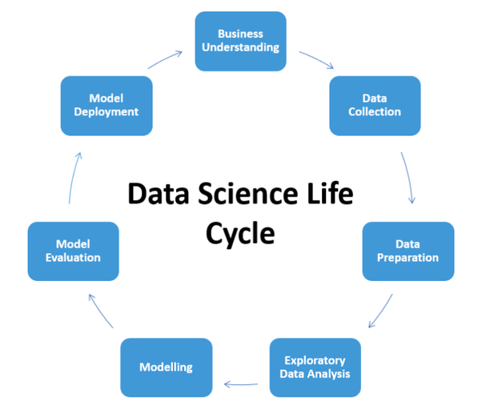
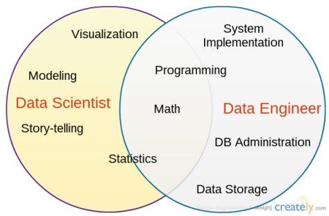
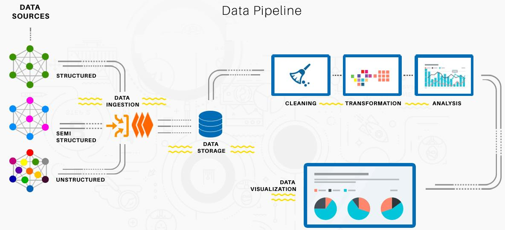

---
presentation:
  # See https://shd101wyy.github.io/markdown-preview-enhanced/#/presentation

  # presentation theme
  theme: blood.css

  # The "normal" size of the presentation, aspect ratio will be preserved
  width: 1600
  height: 900

  # Factor of the display size that should remain empty around the content
  margin: 0.05

  # Display a presentation progress bar
  progress: true

  # Enable keyboard shortcuts for navigation
  keyboard: true

  # Number of milliseconds between automatically proceeding to the
  # next slide, disabled when set to 0, this value can be overwritten
  # by using a data-autoslide attribute on your slides
  autoSlide: 0

  # Vertical centering of slides
  center: false

  # Stop auto-sliding after user input
  autoSlideStoppable: true

  # Loop the presentation
  loop: false

  # Enable Speake Notes
  enableSpeakerNotes: true

  # Number of slides away from the current that are visible
  viewDistance: 3

---

<!-- slide data-background-image=imgs/wp1.jpg -->

## Data Science Acámica - DS-COR3
------------------------------------------
### Leandro Ferrado, Javier Lezama, Valentina Rubiolo

#### 19 de Marzo de 2019

<!-- slide  data-background-image=imgs/wp2.jpg-->

## Semana 6 - Data Pipelines
-------------------------------------

### Agenda
-------------------------------------
##### - Data Science Lifecycle
##### - Data Engineer tasks
##### - Data Pipelines
##### - Transformaciones

-------------------------------------

<!-- slide  data-background-image=imgs/wp2.jpg-->

## Data Science Lifecycle
-------------------------------------

<!-- slide  data-background-image=imgs/wp2.jpg-->

## Data Engineer vs Data Scientist
-------------------------------------

<!-- slide  data-background-image=imgs/wp2.jpg-->

## Data Engineer vs Data Scientist
-------------------------------------

<!-- slide  data-background-image=imgs/wp2.jpg-->

## Data Engineering Tasks
-------------------------------------

<!-- slide  data-background-image=imgs/wp2.jpg-->

## Data Pipeline Example
-------------------------------------

<!-- slide  data-background-image=imgs/wp2.jpg-->

## Standard Scaling
-------------------------------------

<!-- slide  data-background-image=imgs/wp2.jpg-->

## Scikit-learn Scaling
-------------------------------------

> Más info: https://python-data-science.readthedocs.io/en/latest/normalisation.html

<!-- slide  data-background-image=imgs/wp2.jpg-->

## Scikit-learn Pipeline
-------------------------------------

> Ejemplo: https://www.kaggle.com/jankoch/scikit-learn-pipelines-and-pandas/notebook
