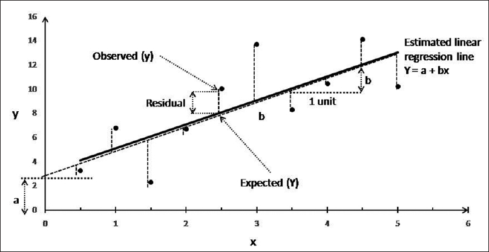
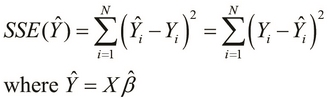
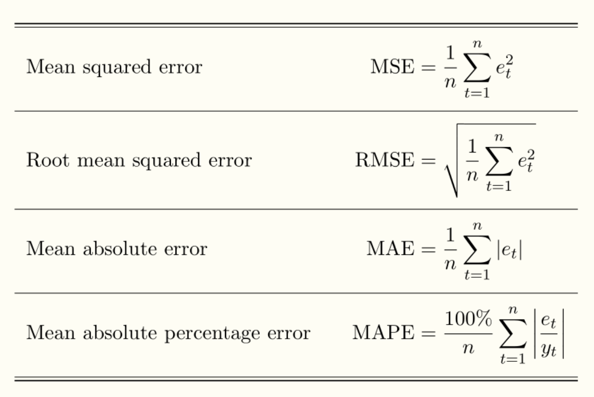
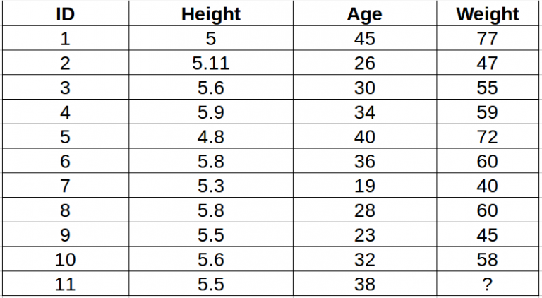
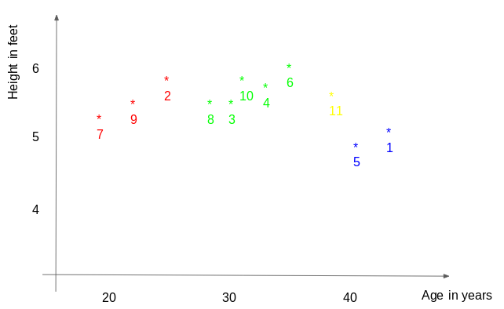
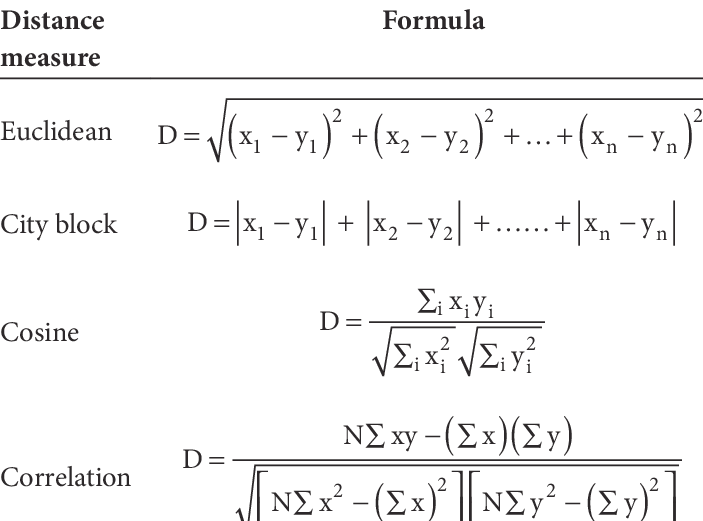
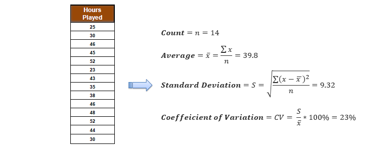

---
presentation:
  # See https://shd101wyy.github.io/markdown-preview-enhanced/#/presentation

  # presentation theme
  theme: blood.css

  # The "normal" size of the presentation, aspect ratio will be preserved
  width: 1600
  height: 900

  # Factor of the display size that should remain empty around the content
  margin: 0.05

  # Display a presentation progress bar
  progress: true

  # Enable keyboard shortcuts for navigation
  keyboard: true

  # Number of milliseconds between automatically proceeding to the
  # next slide, disabled when set to 0, this value can be overwritten
  # by using a data-autoslide attribute on your slides
  autoSlide: 0

  # Vertical centering of slides
  center: false

  # Stop auto-sliding after user input
  autoSlideStoppable: true

  # Loop the presentation
  loop: false

  # Enable Speake Notes
  enableSpeakerNotes: true

  # Number of slides away from the current that are visible
  viewDistance: 3

---

<!-- slide data-background-image=imgs/wp1.jpg -->

## Data Science Acámica - DS-COR3
------------------------------------------
### Leandro Ferrado, Javier Lezama, Valentina Rubiolo

#### 30 de Abril de 2019

<!-- slide  data-background-image=imgs/wp2.jpg-->

## Semana 12 - Regresión en ML
-------------------------------------

### Agenda
-------------------------------------
##### - Repaso de Regresión Lineal
##### - Métricas de Regresión
##### - KNN Regressor
##### - DecisionTree Regressor

-------------------------------------

<!-- slide  data-background-image=imgs/wp2.jpg-->

## Repaso de Regresión Lineal
-------------------------------------

-------------------------------------

<!-- slide  data-background-image=imgs/wp2.jpg-->

## Repaso de Regresión Lineal
-------------------------------------

**MODELO**

**OPTIMIZACIÓN**

-------------------------------------

<!-- slide  data-background-image=imgs/wp2.jpg-->

## Métricas de Regresión
-------------------------------------

-------------------------------------

<!-- slide  data-background-image=imgs/wp2.jpg-->

## KNN - Regresión (Ejemplo)
-------------------------------------

-------------------------------------

<!-- slide  data-background-image=imgs/wp2.jpg-->

## KNN - Regresión (Ejemplo)
-------------------------------------

-------------------------------------

<!-- slide  data-background-image=imgs/wp2.jpg-->

## KNN - Algorithm (classification)
-------------------------------------

-------------------------------------

<!-- slide  data-background-image=imgs/wp2.jpg-->

## KNN - Distancia
-------------------------------------

-------------------------------------

<!-- slide  data-background-image=imgs/wp2.jpg-->

## KNN - Región de decisión según "k"
-------------------------------------

.

-------------------------------------

<!-- slide  data-background-image=imgs/wp2.jpg-->

## KNN - Pros and Cons
-------------------------------------

- Es escalable?
- Qué pasa cuando aumenta la cantidad de datos?
- Grados de libertad?
- Complejidad?
- Robustez a outliers?

-------------------------------------

<!-- slide  data-background-image=imgs/wp2.jpg-->

## KNN - Pros and Cons
-------------------------------------

-------------------------------------

<!-- slide  data-background-image=imgs/wp2.jpg-->

## KNN - Notebook
-------------------------------------

-------------------------------------

<!-- slide  data-background-image=imgs/wp2.jpg-->

## Decision Tree - CART
-------------------------------------
**Idea de árbol**

-------------------------------------

<!-- slide  data-background-image=imgs/wp2.jpg-->

## Decision Tree - CART
-------------------------------------
**Concepto de homogeneidad**

-------------------------------------

<!-- slide  data-background-image=imgs/wp2.jpg-->

## Decision Tree - CART
-------------------------------------
**Costo - Clasificación**

-------------------------------------

<!-- slide  data-background-image=imgs/wp2.jpg-->

## Decision Tree - CART
-------------------------------------
**Costo - Regresión**

-------------------------------------

<!-- slide  data-background-image=imgs/wp2.jpg-->

## Decision Tree
-------------------------------------
### Overfitting?

> - **Pre-pruning:** Requiere conocer un threshold para evitar un prunning.
> - **Post-pruning:** Se debe computar el árbol entero para luego realizar el pruning en base a las hojas resultantes.
> - **Max depth:** Limitar el crecimiento hasta un máximo de splits permitido.  

-------------------------------------

<!-- slide  data-background-image=imgs/wp2.jpg-->

## Decision Tree - Pros y Cons
-------------------------------------

- Simplicidad? Interpretación?
- Grados de libertad?
- Apto para cualquier tipo de de datos?
- Desempeño con datos no lineales?
- Robustez a outliers? Estabilidad?

-------------------------------------

<!-- slide  data-background-image=imgs/wp2.jpg-->

## Decision Tree - Notebook
-------------------------------------

-------------------------------------
