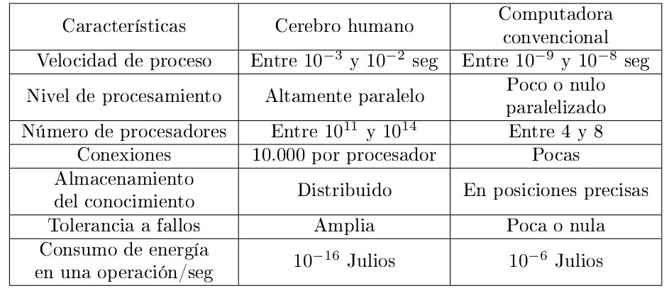
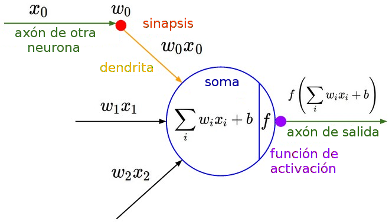
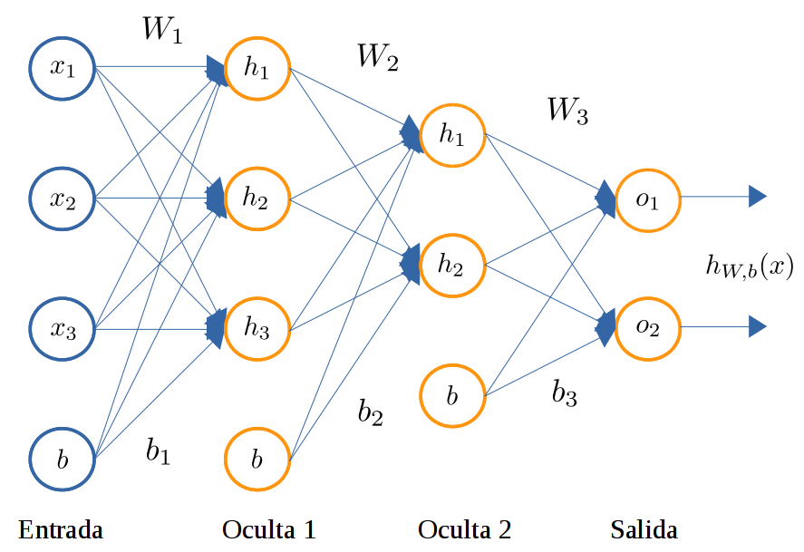
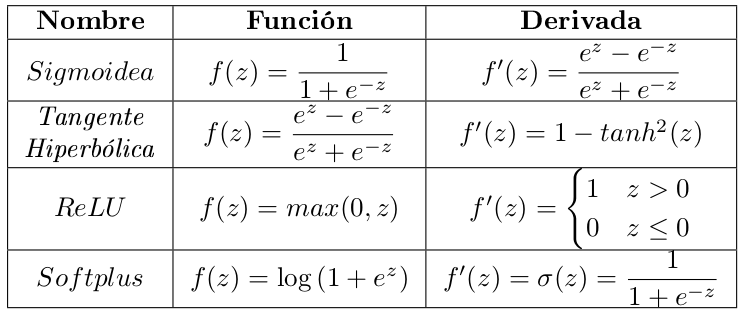
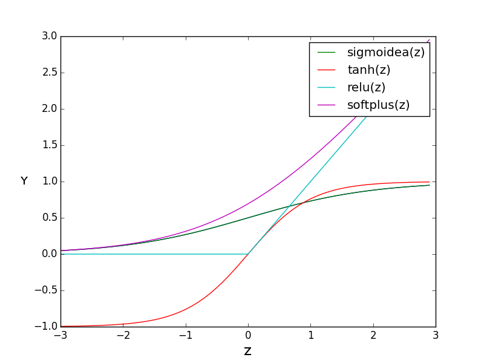
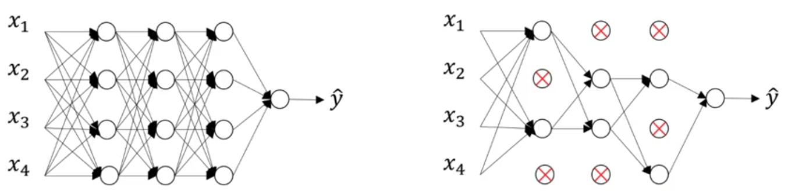
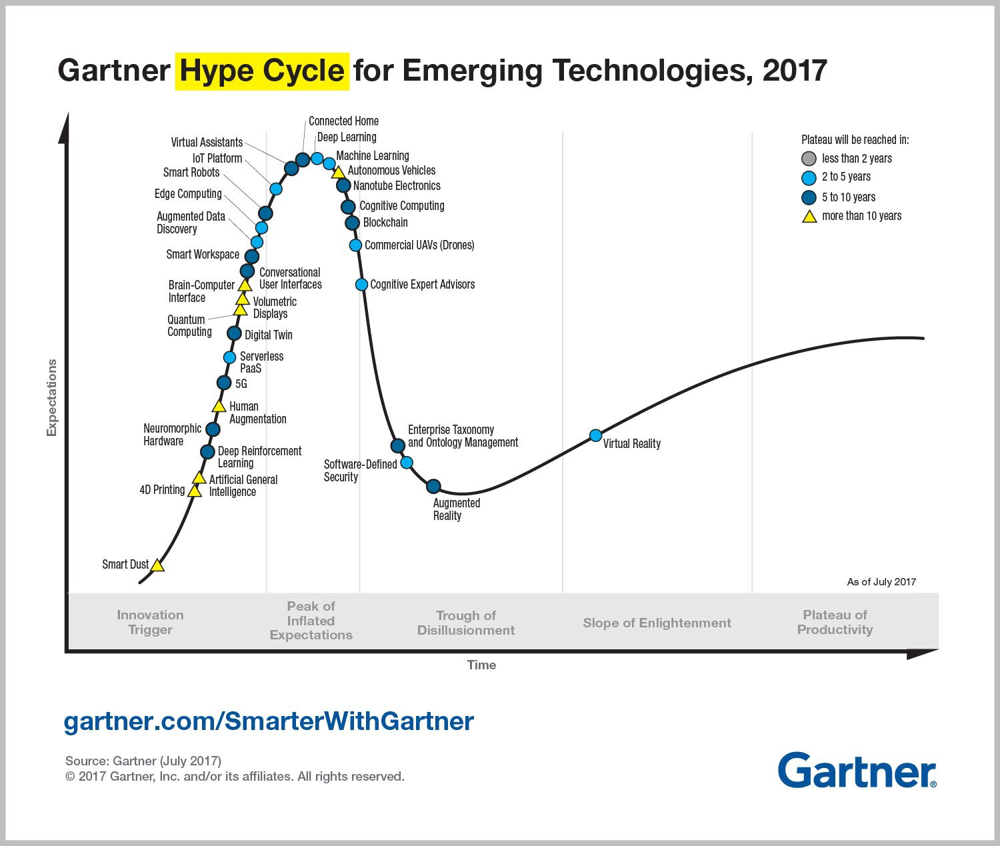
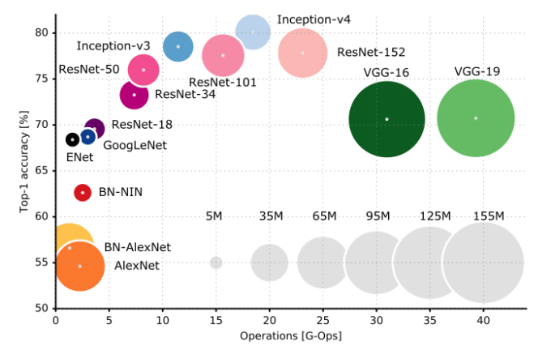

---
presentation:
  # See https://shd101wyy.github.io/markdown-preview-enhanced/#/presentation

  # presentation theme
  theme: blood.css

  # The "normal" size of the presentation, aspect ratio will be preserved
  width: 1600
  height: 900

  # Factor of the display size that should remain empty around the content
  margin: 0.05

  # Display a presentation progress bar
  progress: true

  # Enable keyboard shortcuts for navigation
  keyboard: true

  # Number of milliseconds between automatically proceeding to the
  # next slide, disabled when set to 0, this value can be overwritten
  # by using a data-autoslide attribute on your slides
  autoSlide: 0

  # Vertical centering of slides
  center: false

  # Stop auto-sliding after user input
  autoSlideStoppable: true

  # Loop the presentation
  loop: false

  # Enable Speake Notes
  enableSpeakerNotes: true

  # Number of slides away from the current that are visible
  viewDistance: 3

---

<!-- slide data-background-image=imgs/wp1.jpg -->

## Data Science Acámica - DS-COR3
------------------------------------------
### Leandro Ferrado, Javier Lezama, Valentina Rubiolo

#### 6 de Junio de 2019

<!-- slide  data-background-image=imgs/wp2.jpg-->

## Semana 16 - Redes Neuronales
-------------------------------------

### Agenda
-------------------------------------
##### - Gradiente Descendiente
##### - Arquitectura de NN
##### - Backpropagation
##### - Regularización
##### - Tratamiento de parámetros
##### - Deep Learning

-------------------------------------

<!-- slide  data-background-image=imgs/wp2.jpg-->

## Gradiente Descendiente
-------------------------------------

- Método de optimización más común en redes neuronales.

  

- Requiere computar sobre los datos:
  - Función de *loss* o costo $L(\theta)$
  - Su gradiente $∇_\theta L(\theta)$
  - Siendo θ el conjunto de parámetros del modelo

- Es iterativo (trata de reducir $L(\theta)$ mediante "épocas")
- Dirección opuesta al gradiente de la función objetivo
- Se aplican actualizaciones: $\theta + \delta\theta$ (basadas en el costo $L$ y el gradiente $\nabla L$)

-------------------------------------

<!-- slide  data-background-image=imgs/wp2.jpg-->

## Gradiente Descendiente
-------------------------------------

- En cada iteración se puede trabajar con un "batch" de datos.
  - Principalmente con un dataset grande

  

  - Buena aproximación y convergencia más rápida

- Expresión básica:
  - $θ = θ − η∇ θ L(θ)$

- Tasa de aprendizaje:
  - *Fija:* SGD
  - *Momentum:* SGD + Momentum, NAG
  - *Adaptativa:* Adagrad, ADAM, Adadelta, RMSprop

-------------------------------------

<!-- slide  data-background-image=imgs/wp2.jpg-->

## Gradiente Descendiente
-------------------------------------

#### Velocidad de convergencia

-------------------------------------

<!-- slide  data-background-image=imgs/wp2.jpg-->

## Redes Neuronales
-------------------------------------

- Rama antigua de AI, que cobró mayor popularidad en últimas décadas.
- Trata de emular el comportamiento del cerebro humano
  - Adquirir conocimiento del entorno mediante un proceso de aprendizaje
  - Almacenarlo para disponer de su uso

-------------------------------------

<!-- slide  data-background-image=imgs/wp2.jpg-->

## Arquitectura de NN
-------------------------------------

- Unidad básica de cómputo: neurona
- Modelo matemático asociado: perceptrón.
  - Recibe información de entrada $x$
  - Pondera entrada mediante pesos sinápticos $w$ y bias $b$
  - Computa el "estímulo" asociado mediante una *función de activación*
- Neuronas se agrupan en una "capa" (nivel de procesamiento de la red)

-------------------------------------

<!-- slide  data-background-image=imgs/wp2.jpg-->

## Arquitectura de NN
-------------------------------------

#### Simple Perceptron

-------------------------------------

<!-- slide  data-background-image=imgs/wp2.jpg-->

## Arquitectura de NN
-------------------------------------

- Se pueden agrupar capas para armar un "perceptrón multicapa" (MLP).
  - Capas: Entrada + Ocultas + Salida
  - La salida puede ser un clasificador (e.g. logistic regression) o un regresor (e.g. linear regressor).
- Forma vectorial: matriz de pesos $W$, vector bias $b$ y de entrada $x$
  - $z = Wx + b$  (salida lineal de una capa)
  - $a = f(z)$  (salida activada de una capa)

-------------------------------------

<!-- slide  data-background-image=imgs/wp2.jpg-->

## Arquitectura de NN
-------------------------------------

#### Ejemplo de MLP

-------------------------------------

<!-- slide  data-background-image=imgs/wp2.jpg-->

## Arquitectura de NN
-------------------------------------
#### Ejemplos de funciones de activación

-------------------------------------

<!-- slide  data-background-image=imgs/wp2.jpg-->

## Arquitectura de NN
-------------------------------------
#### Ejemplos de funciones de activación

-------------------------------------

<!-- slide  data-background-image=imgs/wp2.jpg-->

## Backpropagation
-------------------------------------

- Algoritmo de aprendizaje para computar actualizaciones de una NN
- Actualmente es el estándar para el entrenamiento de NN
- Procedimiento:
  - **Forward step:** computar activaciones hasta obtener salida
  - **Error:** Se computa el costo asociado $L(θ)$   
  - **Backward step:** se calculan gradientes desde la salida hasta la entrada (usando regla de la cadena).
  - **Resultado:** Valor de $L(θ)$ y su gradiente $∇L(θ)$ respecto a todos los parámetros de la red, listo para ser usado en un algoritmo de optimización basado en gradiente descendiente.

-------------------------------------

<!-- slide  data-background-image=imgs/wp2.jpg-->

## Backpropagation
-------------------------------------

-------------------------------------

<!-- slide  data-background-image=imgs/wp2.jpg-->

## Profundidad de la red
-------------------------------------

- Pocas neuronas en una capa?
- Demasiadas neuronas en una capa?
- Demasiadas capas?
- Analizar comportamiento "a priori"
  - Red con capas: [50, 5, 50, 5]
  - Red con capas: [50, 500, 1000, 1]
  - Regresión, todas las capas activadas por *tanh*

-------------------------------------

<!-- slide  data-background-image=imgs/wp2.jpg-->

## Tratamiento de pesos sinápticos
-------------------------------------

- **Inicialización de pesos:** Asegurar convergencia, lo más rápido posible
  - Todos 0? Todos 1?
    - Valores muy pequeños → "vanishing gradient"
    - Valores muy grandes → "exploding gradient"
  - Muestreo de una distribución: Uniforme, Normal, Xavier, etc
  - Puede depender del tipo de función de activación
  - Pre-entrenamiento (UL) + Fine tuning (SL)

-------------------------------------

<!-- slide  data-background-image=imgs/wp2.jpg-->

## Tratamiento de pesos sinápticos
-------------------------------------

- **Regularización de pesos:** penalizar la complejidad del
modelo para mitigar "over-fitting".

  - **Norma $L_{1}$:** $ L(W, b)_{new} = L(W, b) + λ_1 Σ W^2$
  - **Norma $L_{2}$:** $L(W, b)_{new} = L(W, b) + λ_2 Σ |W|$
  - **DropOut:**
    - Anular componentes de entrada con probabilidad $p$
    - Simula corrupción de la información de entrada
    - Concentra información en pocas neuronas

-------------------------------------

<!-- slide  data-background-image=imgs/wp2.jpg-->

## Deep Learning
-------------------------------------

- Redes neuronales muy profundas? Qué tan profundas?
- Impulsado por el avance de algoritmos y hardware (e.g. GPU, cómputo distribuido)
- Estado del arte en diversas tareas (e.g. computer vision, NLP, voice recog, etc).
- Modelos con inmenso poder de expresión, y por ende enorme complejidad.

-------------------------------------

<!-- slide  data-background-image=imgs/wp2.jpg-->

## Deep Learning - Algoritmos
-------------------------------------

#### Before Deep Learning

- 1957: Perceptron
- 1980: Convolutional Neural Networks (CNN)
- 1982: Recurrent Neural Networks (RNN)
- 1986: Backpropagation
- 1997: Long-Short Term Memory (LSTM)
-------------------------------------

<!-- slide  data-background-image=imgs/wp2.jpg-->

## Deep Learning - Algoritmos
-------------------------------------

#### After Deep Learning

- 2007: Deep Belief Networks
- 2009: AutoEncoders (AE)
- 2014: Generative Adversarial Network (GAN)
- 2015: Residual Networks (ResNet)
- 2017: Capsule Neural Network (CapsNet)
- 2018: BERT

> Desafío: Elegir un algoritmo de Deep Learning y explicarlo en clases (5 minutos)

-------------------------------------

<!-- slide  data-background-image=imgs/wp2.jpg-->

## Deep Learning - Casos de éxito
-------------------------------------

- 2012: Google - Gatos en YouTube
- 2014: Facebook - DeepFace
- 2015: Google - OCR in Street View
- 2016: Google - AlphaGo
- 2018: Google - Voice Assistants
- ...

-------------------------------------

<!-- slide  data-background-image=imgs/wp2.jpg-->

## Redes Neuronales - Notebook
-------------------------------------

-------------------------------------
